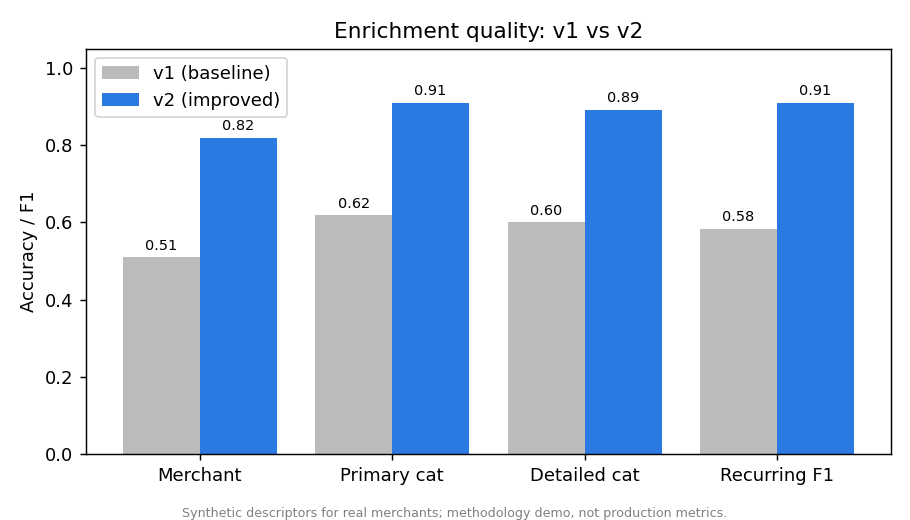
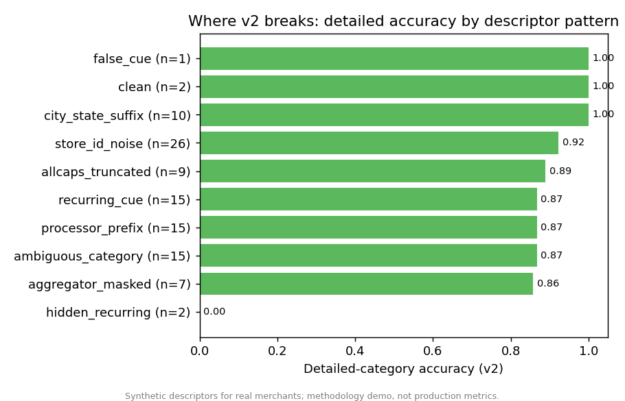
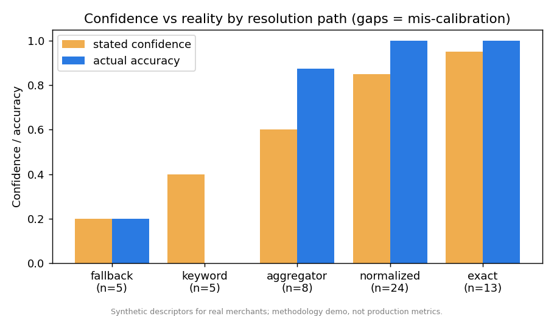

[View on GitHub](https://github.com/pfelix828/enrich-eval){.btn .btn-outline-primary} [Live App](https://enrich-eval.streamlit.app){.btn .btn-outline-primary}

## What This Project Does

Open your banking app and look at a recent purchase. Behind the scenes, your bank received something
ugly and cryptic, like:

> `SQ *BLUE BOTTLE COFFEE OAKLAND CA`

A system has to turn that into something a person can read: the merchant is **Blue Bottle Coffee**,
the category is **Coffee**, and it's **not** a recurring subscription. That cleanup step is called
**enrichment**, and thousands of finance apps depend on it being right.

Here's the hard part. It's fairly easy to build something that *attempts* this. It's genuinely
difficult to know *how good* your attempt actually is — because "correct" is fuzzy (is `Blue Bottle`
as good as `Blue Bottle Coffee`?), and because the complaints you get are vague ("your categories are
wrong for my users"). You can't eyeball quality across millions of transactions.

**This project isn't an enrichment system. It's the measuring tape for one.** It's a harness that
tells you, in a principled way, exactly where an enrichment system is wrong, which failures matter
most, and what to fix first.

## Why This Matters in the Real World

Plenty of data science projects build a model and report a single accuracy number. But in production,
the harder and more valuable job is often the *evaluation*: defining what "good" means, turning a
fuzzy customer complaint into a specific engineering fix, and catching the moment a "better" model
quietly breaks something it used to get right.

This project recreates that evaluation discipline end-to-end. It scores a deliberately simple
enrichment system so the spotlight stays on the measurement, not the model.

::: {.callout-note}
**A note on the data.** The transaction strings here are *synthetic descriptors for real merchants* —
made-up strings formatted to look like real bank statements, never actual cardholder data (which is
private and contains personal information). So the specific numbers below are a demonstration of the
method, not a production benchmark. The point is the approach, which carries over directly to real
data. The category labels use [Plaid's public Personal Finance Category taxonomy](https://plaid.com/docs/transactions/transactions-data/#personal-finance-category)
(16 broad categories, 103 detailed ones).
:::

## The Approach in Plain English

I built the project in layers, each answering a question the layer before it raised.

**1. Define "correct" before measuring it.** I wrote a labeling rulebook that settles the judgment
calls up front: Starbucks is *Coffee*, not *Fast Food*; Amazon is an *online marketplace*, not a
superstore; when a delivery app like DoorDash hides the real restaurant, you label the app and admit
the restaurant is unknowable. Then I hand-built a 52-transaction answer key covering the messy
patterns that trip systems up — payment-processor prefixes (`SQ *`, `PYPL *`), delivery apps that
mask the merchant, ALL-CAPS truncation, and store-ID noise.

**2. Score two versions of the system.** A first-pass enricher (v1) and an improved one (v2), so I
could measure not just quality but *change* in quality.

**3. Handle the "close enough" problem with a judge — and then check the judge.** Strict text-matching
would wrongly mark `Blue Bottle` as a miss against `Blue Bottle Coffee`. So a judge decides when two
names mean the same merchant. Crucially, I don't trust a judge I haven't measured: I validated it
against 24 human-labeled pairs, including deliberately tricky ones (is `Amazon` the same as `Amazon
Prime`? No). The judge agreed with human judgment **92%** of the time.

**4. Turn a vague complaint into a ranked to-do list.** This is the centerpiece. You type a real
complaint — *"categorization is wrong for a lot of my users"* — and the harness finds the failing
transactions, groups them by root cause, and ranks the groups by how much damage they do.

**5. Catch silent regressions.** Every time the model changes, the harness re-checks every
transaction and flags any that used to be right and just became wrong.

## What the Harness Found

Moving from v1 to v2 improved every headline number — merchant accuracy jumped from 51% to 82%,
category accuracy from 62% to 91%. But the averages hide the interesting parts.

**Finding 1 — Averages lie; quality is wildly uneven.** Clean strings get enriched nearly perfectly.
Transactions where a delivery app or payment processor masks the real merchant are where everything
falls apart. A single accuracy number would have hidden that completely.

**Finding 2 — The system doesn't know when it's wrong.** A confidence score is only useful if it
tracks reality. It doesn't here, and unevenly: the guess-from-a-keyword path reports 40% confidence
but is **0% accurate** (confidently wrong, which is the worst kind — those answers look trustworthy
and reach customers), while the delivery-app path is the opposite, underconfident. You only see this
by comparing confidence to accuracy along each path, not in aggregate.

**Finding 3 — "Better on average" can still break things.** v2 improved 18 merchants but *broke one*:
its smart new rule for delivery apps saw the `PYPL` (PayPal) prefix on a Steam game purchase and
mislabeled it as PayPal, when v1 had correctly called it Steam. The rule that fixed many transactions
quietly broke this one. **This is the entire reason you run an evaluation on every change** — a release
that improves the average can still ship a specific, customer-visible regression.

**Finding 4 — Some things can't be known from one transaction.** Recurring-subscription detection
lands at an F1 of 0.91, and it's deliberately not higher. You usually can't tell a subscription from a
single line of text — you'd need to see the charge repeat each month. The harness includes cases that
prove it: a real gym membership with no telltale word (the system misses it) and a one-off purchase at
a store named "Monthly Market" (the word *monthly* wrongly trips the recurring flag). An earlier draft
scored a suspicious 1.0 here; that was an artifact of a tiny answer key, and adding cases the rule
genuinely can't solve replaced a misleading perfect score with an honest one. The real fix is looking
at transaction history, not writing a cleverer rule for a single string.

## The Complaint Investigator (the part I'm most proud of)

When a customer says *"categorization is wrong for a lot of my users,"* that's unactionable. The
harness turns it into this:

| Rank | Root cause | Share of errors | Was confident while wrong? |
|---|---|---|---|
| 1 | Merchant not recognized at all (coverage gap) | 67% | No (low confidence) |
| 2 | Delivery app masks the merchant | 17% | Yes |
| 3 | Payment-processor prefix | 17% | Yes |

…plus a specific recommendation for each: *close the knowledge-base coverage gap*, *stop guessing the
masked merchant and flag low confidence instead*, *extend the prefix-stripping rules*. That's the
difference between "quality is bad" and "here are the three things to fix, in order."

## What I'd Do Differently in Production

- **Build the answer key from real descriptors**, with two people labeling a sample and measuring how
  often they agree — the synthetic seed here is a stand-in for that.
- **Use the confidence calibration as a release gate** — suppress or human-review the confidently-wrong
  paths instead of showing them to users.
- **Add the regression check to CI** so no model change ships without passing the per-transaction diff.
- **Bring in transaction history** for recurring detection — you can't always tell a subscription from
  a single line of text; you need to see the pattern over time.

## How It's Built

Deliberately lightweight and fully reproducible. The whole thing runs offline for free, and the
harness is model-agnostic — the same scoring, investigation, and regression layers work whether the
enricher is a simple rules engine or a large language model, which you can swap in with one setting.

## Stack

Python | pandas | scikit-learn | Matplotlib | Streamlit | Anthropic API (optional backend)
